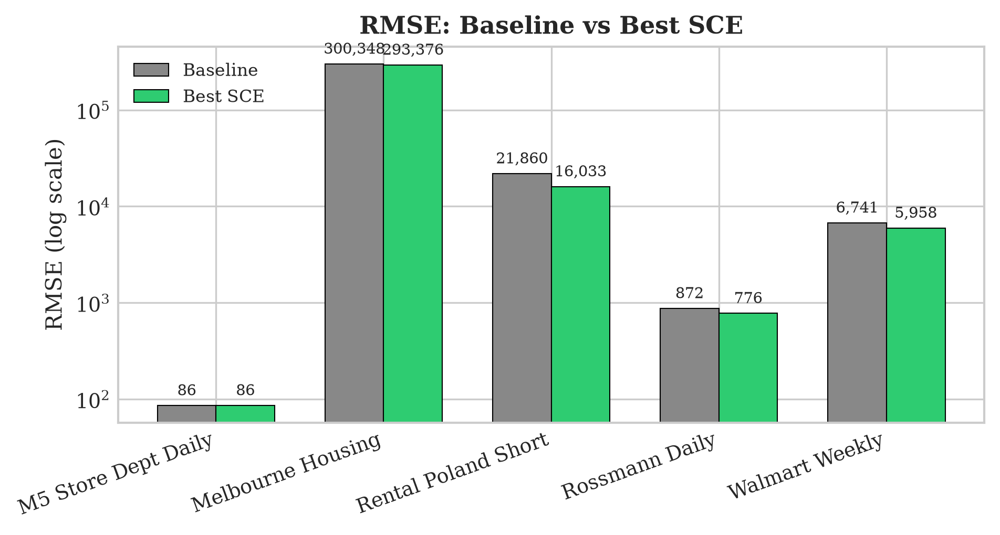
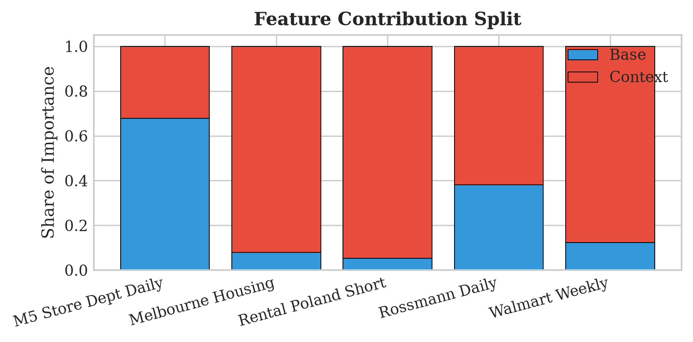
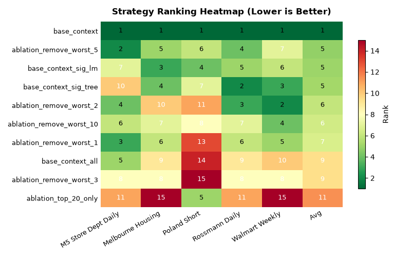

# Experiments

This document describes how to reproduce the SCE validation experiments and generate the paper figures.

## Quick Start

```bash
# Install with data and visualization dependencies
pip install -e ".[data,viz]"

# Run all standard experiments
python scripts/run.py --all

# Run the model-search workflow used for paper-style comparisons
python scripts/run.py --all --search --report
```

## Datasets

SCE was validated on 4 real-world property pricing datasets:

| Dataset | Records | Description |
|---------|---------|-------------|
| rental_poland_short | 830 | Poland apartment rentals (short-term, Airbnb) |
| rental_poland_long | 1,005 | Poland apartment rentals (long-term, Otodom) |
| rental_uae_contracts | 19,799 | UAE rental contracts (Dubai) |
| sales_uae_transactions | 19,800 | UAE property sales (Dubai) |

### Download Datasets

Poland datasets are included in data/parquet/. UAE datasets require download:

```bash
python scripts/download_datasets.py
sce datasets list
sce datasets download rental_uae_contracts
```

Additional remote sources can be declared in the dataset manifest using direct `https://...` URLs or Kaggle-backed sources such as `kaggle://datasets/<owner>/<dataset>/<file>` and `kaggle://competitions/<competition>/<file>`.

### Optional Time-Series Benchmark

An M5-derived benchmark scaffold is included for hierarchical forecasting experiments. Prepare it locally with:

```bash
python scripts/prepare_m5_dataset.py --download
python scripts/run.py --dataset m5_store_dept_daily
```

This config uses a temporal holdout (`split.strategy = "temporal"`) with the last 28 periods reserved for test.

## Experiment Commands

### Run Individual Dataset

```bash
python scripts/run.py --dataset rental_poland_short
python scripts/run.py --dataset rental_poland_long
python scripts/run.py --dataset rental_uae_contracts
python scripts/run.py --dataset sales_uae_transactions
```

### Run All Experiments

```bash
python scripts/run.py --all
```

This will:
1. Load each dataset from data/parquet/.
2. Split the raw data into train/test partitions.
3. Run a baseline model defined in `[model]`.
4. Run the same model with SCE context features fit on train and applied to test.
5. Compare RMSE and R2 metrics.
6. Save results to results/.

## Supported Models

The experiment runner and search workflow support these downstream regressors:

- `xgboost`
- `lightgbm` (requires `pip install stat-context[models]`)
- `catboost` (requires `pip install stat-context[models]`)
- `ridge`
- `random_forest`
- `extra_trees`
- `gradient_boosting`

You can switch models in a dataset config:

```toml
[model]
type = "random_forest"
n_estimators = 300
max_depth = 12

[run]
random_forest_configs = ["default", "regularized"]
```

Or override the model from the CLI:

```bash
python scripts/run.py --dataset rental_poland_short --model-type ridge
python scripts/run.py --dataset rental_poland_short --model-type lightgbm --use-gpu
python scripts/run.py --dataset rental_poland_short --search --model-type extra_trees --model-presets default regularized
```

## Manual Vs Auto Grouping

The core SCE library supports both explicit grouping columns and auto-detection. The runner now exposes that choice directly:

- `manual`: use `sce.categorical_cols` when present, otherwise `features.categorical`
- `auto`: pass no grouping columns into SCE and let the engine detect them from the dataframe

Examples:

```bash
python scripts/run.py --dataset rental_poland_short --categorical-mode manual
python scripts/run.py --dataset rental_poland_short --categorical-mode auto
python scripts/run.py --dataset rental_poland_short --compare-categorical-modes
```

`--compare-categorical-modes` runs the same standard experiment twice on the same dataset and writes a side-by-side comparison under `results/{dataset}_categorical_compare_{timestamp}/`.

## Statistical Baseline Variants

To compare full SCE against simpler grouped target-statistic baselines built on the same grouping keys, use `--context-variant`:

- `sce`: full configured SCE statistics from `[sce].aggregations`
- `target_mean`: leakage-safe grouped target mean only
- `hierarchical_mean_count`: grouped mean + count
- `hierarchical_mean_std_count`: grouped mean + std + count

Examples:

```bash
python scripts/run.py --dataset rental_poland_short --model-type xgboost --context-variant target_mean
python scripts/run.py --dataset rental_poland_short --model-type xgboost --context-variant hierarchical_mean_count
python scripts/run.py --dataset rental_poland_short --model-type xgboost --context-variant hierarchical_mean_std_count
python scripts/run.py --all --model-type catboost --context-variant target_mean --use-gpu
```

These variants reuse the same split-first evaluation, grouping columns, interaction settings, and minimum group size as SCE, but restrict the aggregated statistics to the specified baseline family.

## GPU Acceleration

GPU acceleration is available for these backends:

- `xgboost`
- `lightgbm`
- `catboost`

Enable it from the CLI with:

```bash
python scripts/run.py --dataset rental_poland_short --model-type catboost --use-gpu
```

Or from a dataset config:

```toml
[model]
type = "lightgbm"
use_gpu = true
gpu_device_id = 0
```

CPU-only models such as `ridge`, `random_forest`, `extra_trees`, and `gradient_boosting` ignore the GPU flag.

### Generate Paper Figures

After running experiments:

```bash
python scripts/generate_figures.py
python scripts/generate_paper_appendix_figures.py
```

To summarize a specific batch of search runs without mixing in older artifacts:

```bash
python scripts/generate_search_batch_summary.py \
	results/m5_store_dept_daily_search_20260330_122229 \
	results/rental_poland_long_search_20260330_095415 \
	results/rental_poland_short_search_20260330_101026 \
	results/rental_uae_contracts_search_20260330_102425 \
	results/sales_uae_transactions_search_20260330_104755 \
	--output-dir results/search_rerun_summary_20260330_123900
```

This writes a combined CSV summary, a markdown report, and comparison plots for just the listed run directories.

## Results

### Main Paper Figures

| Figure | Description | File |
|--------|-------------|------|
| M1 | RMSE Improvement |  |
| M2 | Feature Contributions |  |
| M3 | Strategy Ranking |  |

### Key Results (Summary)

| Dataset | Baseline RMSE | + SCE RMSE | ΔRMSE | ΔR² |
|---------|---------------|------------|-------|-----|
| rental_poland_long | 4,581 | 4,541 | ↓ 0.9% | +1.55 pp |
| rental_poland_short | 27,368 | 22,541 | ↓ 17.6% | +24.49 pp |
| rental_uae_contracts | 465,037 | 360,267 | ↓ 22.5% | +3.83 pp |
| sales_uae_transactions | 32,489,660 | 26,353,228 | ↓ 18.9% | +25.83 pp |

Average RMSE improvement: about 15%.

### Appendix Figures (Per-Dataset)

Each dataset has 6 appendix figures (A1-A6):

- A1: RMSE comparison (baseline vs SCE)
- A2: R2 comparison (baseline vs SCE)
- A3: Feature importance breakdown
- A4: Feature ablation summary
- A5: Linear-model context t-statistics
- A6: Complexity vs RMSE

| Dataset | Figures |
|---------|---------|
| rental_poland_short | [A1](figures/appendix/appendix_rental_poland_short_A1.png) [A2](figures/appendix/appendix_rental_poland_short_A2.png) [A3](figures/appendix/appendix_rental_poland_short_A3.png) [A4](figures/appendix/appendix_rental_poland_short_A4.png) [A5](figures/appendix/appendix_rental_poland_short_A5.png) [A6](figures/appendix/appendix_rental_poland_short_A6.png) |
| rental_poland_long | [A1](figures/appendix/appendix_rental_poland_long_A1.png) [A2](figures/appendix/appendix_rental_poland_long_A2.png) [A3](figures/appendix/appendix_rental_poland_long_A3.png) [A4](figures/appendix/appendix_rental_poland_long_A4.png) [A5](figures/appendix/appendix_rental_poland_long_A5.png) [A6](figures/appendix/appendix_rental_poland_long_A6.png) |
| rental_uae_contracts | [A1](figures/appendix/appendix_rental_uae_contracts_A1.png) [A2](figures/appendix/appendix_rental_uae_contracts_A2.png) [A3](figures/appendix/appendix_rental_uae_contracts_A3.png) [A4](figures/appendix/appendix_rental_uae_contracts_A4.png) [A5](figures/appendix/appendix_rental_uae_contracts_A5.png) [A6](figures/appendix/appendix_rental_uae_contracts_A6.png) |
| sales_uae_transactions | [A1](figures/appendix/appendix_sales_uae_transactions_A1.png) [A2](figures/appendix/appendix_sales_uae_transactions_A2.png) [A3](figures/appendix/appendix_sales_uae_transactions_A3.png) [A4](figures/appendix/appendix_sales_uae_transactions_A4.png) [A5](figures/appendix/appendix_sales_uae_transactions_A5.png) [A6](figures/appendix/appendix_sales_uae_transactions_A6.png) |

## Reproducibility Notes

- Random seed: 42
- Cross-validation: 5-fold for leakage-safe context
- Train/test split: 80/20
- XGBoost: n_estimators=500, max_depth=6, learning_rate=0.05

All experiments were run on Python 3.11 with:
- scikit-learn 1.4.0
- xgboost 2.0.3
- pandas 2.1.4
- numpy 1.26.3

## Evaluation Note

The engine and experiment runner use clean train-fit / test-transform evaluation. Publication-quality predictive results should split first, fit SCE on the training partition, and transform the test partition with training-derived statistics only.
